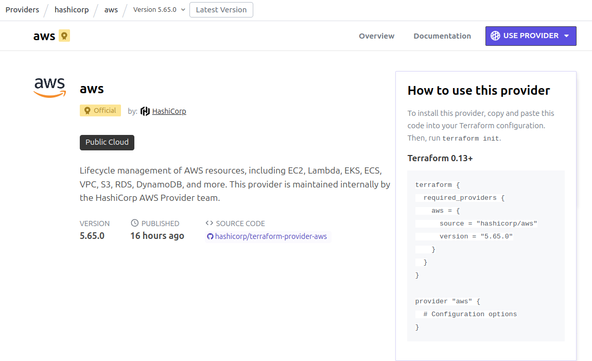
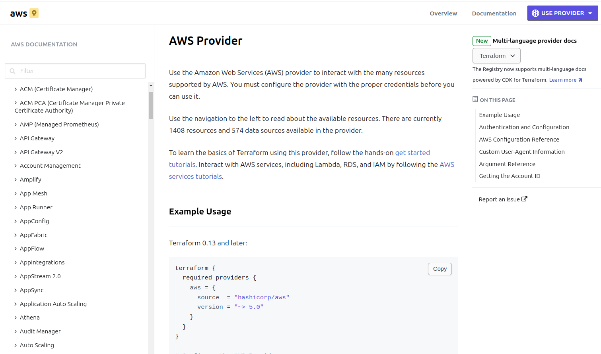

# Provider

No Terraform, um provider é um componente essencial que permite ao Terraform **interagir com APIs de serviços específicos**, como AWS, Azure, Google Cloud, entre outros. Ele serve como uma **ponte** entre o Terraform e os recursos de infraestrutura que você deseja gerenciar.


## Funções principais de um provider:
- **Autenticação:** O provider gerencia a autenticação com o serviço específico, permitindo que o Terraform faça mudanças na infraestrutura.
- **Definição de recursos:** Os providers definem os tipos de recursos que podem ser gerenciados (por exemplo, aws_instance para instâncias EC2 na AWS).
- **Operações CRUD:** Eles permitem criar, ler, atualizar e deletar recursos na infraestrutura.

## AWS Provider
- https://registry.terraform.io/browse/providers



Para instalar este provedor, copie e cole este código na configuração do Terraform. Em seguida, execute o terraform init.

```hcl
terraform {
  required_providers {
    aws = {
      source = "hashicorp/aws"
      version = "5.65.0"
    }
  }
}

provider "aws" {
  # Configuration options
}
```

Esse código Terraform é responsável por configurar o provider da AWS (Amazon Web Services) e especificar a versão exata que será utilizada no projeto. 

- O código configura o Terraform para utilizar o provider da AWS na versão 5.65.0, garantindo consistência e compatibilidade.
- Ele também prepara o espaço para a configuração das credenciais e outras opções necessárias para se conectar e gerenciar recursos na AWS.

## Documentação
- https://registry.terraform.io/providers/hashicorp/aws/latest/docs



## Inicialização do Projeto

```bash
terraform init
```

Quando você executa o comando `terraform init`, o Terraform realiza uma série de ações para preparar o ambiente de trabalho, permitindo que você comece a gerenciar sua infraestrutura. Aqui estão os principais passos que acontecem durante a execução desse comando:

- **Download de Providers**
O Terraform verifica o bloco *required_providers* no seu arquivo de configuração (.tf) para identificar quais providers são necessários.
Em seguida, ele baixa esses providers (plugins) do Terraform Registry ou de outras fontes configuradas. Isso inclui a versão específica dos providers definida no código.
Os providers são armazenados localmente no diretório .terraform dentro do diretório de trabalho.